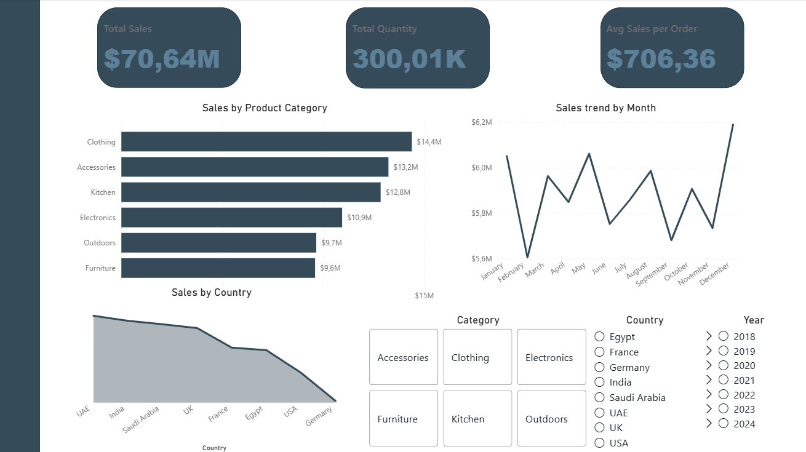
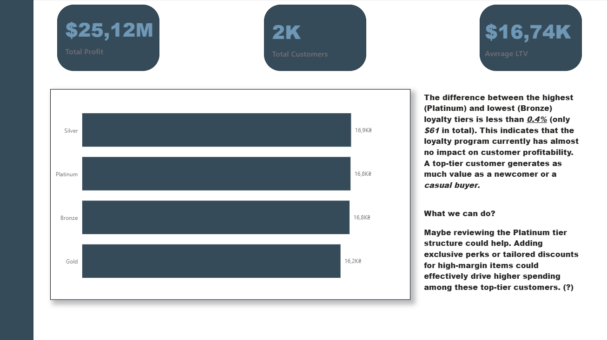
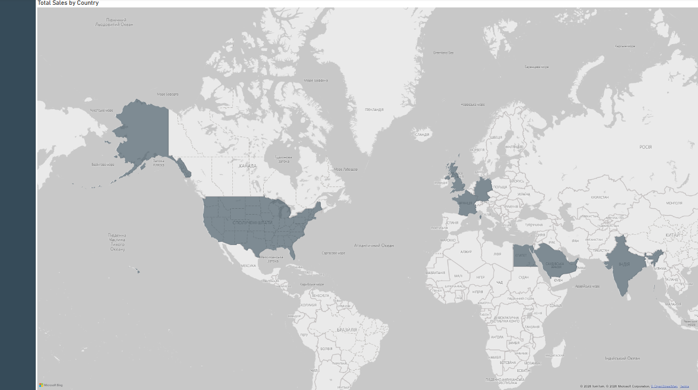

# Power BI Sales Data Analysis

This project analyzes sales performance using Power BI. It includes a cleaned CSV dataset, a Power BI report, and dashboard screenshots for quick review.

The goal was to build a data analyst-style report: prepare the data, model relationships, create measures, visualize key metrics, and highlight patterns in sales, geography, product categories, and customer segments.

## Dashboard Preview

### Executive Dashboard



### Customer Details



### Sales by Country



## What I Analyzed

- Total sales, total quantity, average sales per order, total profit, and average customer value.
- Sales trends by month.
- Sales distribution by product category and country.
- Customer value by loyalty tier.
- Geographic sales performance using a map view.

## Key Insights

- Clothing generated the highest sales among product categories in the dashboard view.
- December showed the strongest monthly sales result.
- Sales were distributed across multiple countries, with the highest values concentrated in a few markets.
- Loyalty tiers had very similar average customer value, suggesting that tier level did not strongly separate high-value customers in this dataset.

## Dataset

The project uses a star-schema style dataset:

- `FactSales.csv` - sales transactions
- `DimCustomer.csv` - customer information and loyalty tiers
- `DimProduct.csv` - product details and categories
- `DimEmployee.csv` - employee dimension
- `DimGeography.csv` - country and geography data

## Tools

- Power BI
- Power Query
- DAX
- CSV data modeling

## Repository Structure

```text
.
├── data/
│   ├── DimCustomer.csv
│   ├── DimEmployee.csv
│   ├── DimGeography.csv
│   ├── DimProduct.csv
│   └── FactSales.csv
├── report/
│   └── sales_data_analysis_dashboard.pbix
├── screenshots/
│   ├── customer_details.png
│   ├── exec_dashboard.png
│   └── map.png
└── README.md
```

## How to View

Open `report/sales_data_analysis_dashboard.pbix` in Power BI Desktop. The screenshots above show the main report pages if you only want a quick preview.
